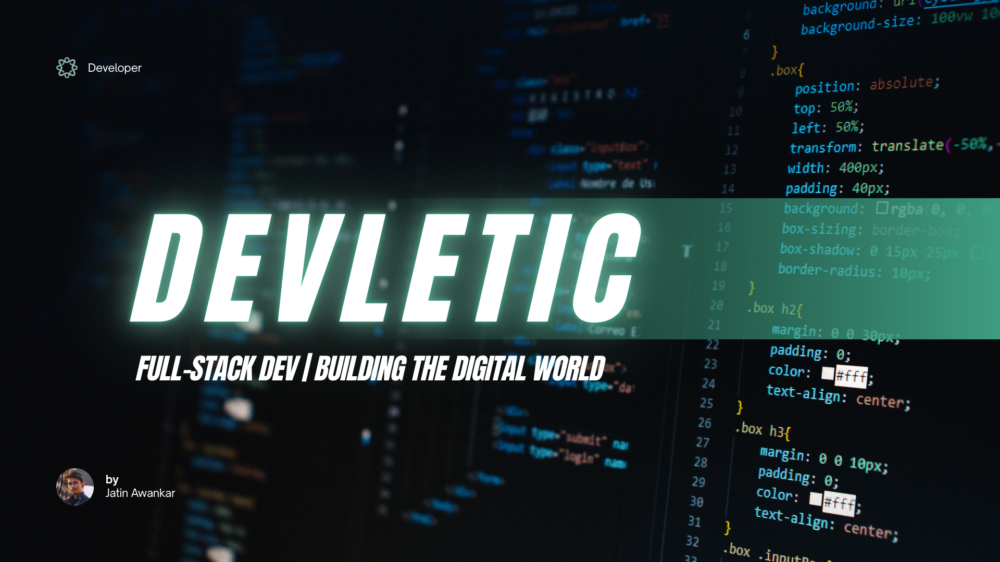

<!---->

<h1 align="center">Hey there!👋 I'm Jatin Awankar</h1>
<h3 align="center">Currently on the way to be a professional Full-Stack Developer</h3>

</img>

  

- 🌱 I’m currently learning to build *Scalable Projects*

- 📫 How to reach me *jatinawankar02@gmail.com*

<h3 align="left">Connect with me:</h3>

<h3 align="left">Tools and Technologies:</h3>

 
  
  
   
  
  
   
  
  
  
  
  
  
  
   
  

<picture>
  <source
    media="(prefers-color-scheme: dark)"
    srcset="https://raw.githubusercontent.com/platane/snk/output/github-contribution-grid-snake-dark.svg"
  />
  <source
    media="(prefers-color-scheme: light)"
    srcset="https://raw.githubusercontent.com/platane/snk/output/github-contribution-grid-snake.svg"
  />
  
</picture>
